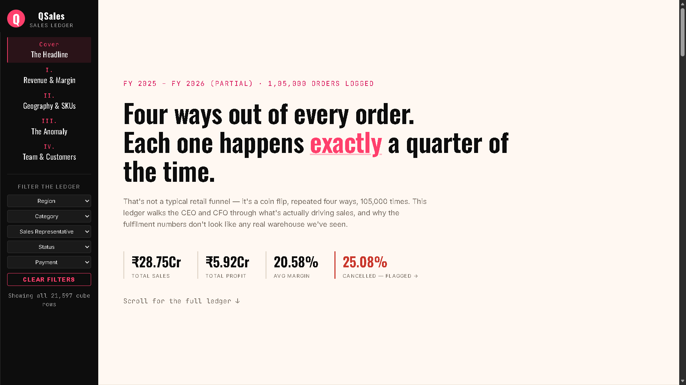
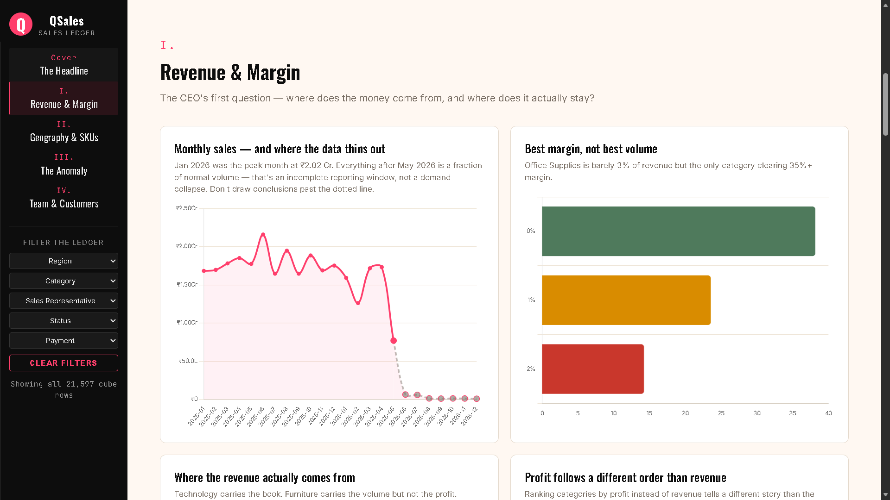
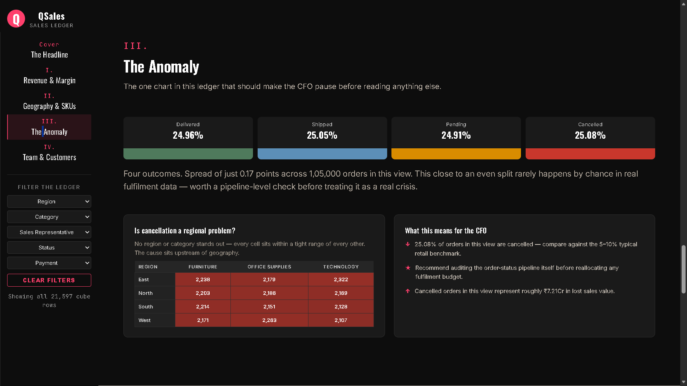
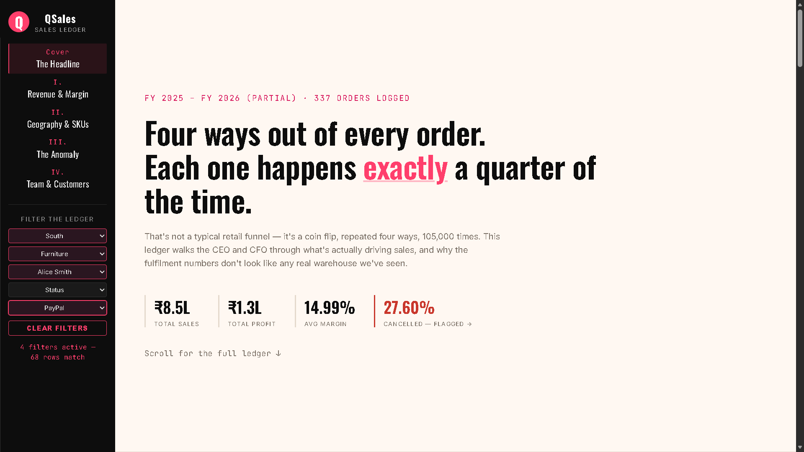

# Sales Data Cleaning & Reporting System


An end-to-end **Data Quality, ETL, Business Intelligence, and Executive Reporting System** that audits, cleans, validates, and analyzes 100,000+ transactional sales records while delivering an interactive executive dashboard for operational monitoring, anomaly detection, and strategic decision-making.

---

## Live Dashboard

🔗 **Live Dashboard:**
https://girishshenoy16.github.io/sales-data-cleaning-reporting-system/

---

## Dashboard Preview



---

# Executive Summary

Poor data quality creates poor business decisions.

This project establishes a complete ETL and reporting pipeline that transforms a noisy transactional sales ledger into a trusted executive reporting platform.

The solution combines:

* Data Cleaning & Validation
* Automated ETL Processing
* Data Quality Auditing
* Interactive Business Intelligence
* Executive KPI Monitoring
* Operational Anomaly Detection
* Executive Storytelling & Reporting

---

# Business Problem

Senior leadership requires reliable data to answer critical business questions.

## CEO Questions

* Are we growing?
* Are we profitable?
* Which products drive performance?
* Where are operational risks?
* What issues require immediate investigation?

## CFO Questions

* What is the true profit margin?
* Are calculations accurate?
* Are we losing revenue?

## COO Questions

* Is fulfillment operating correctly?
* Are cancellations within acceptable limits?
* Are operational workflows healthy?

The project was designed to provide these answers through a trusted data pipeline and executive dashboard.

---

# Executive Dashboard Features

## I. Revenue & Margin Intelligence

* Total Revenue
* Total Profit
* Profit Margin %
* Monthly Revenue Trend
* Revenue Contribution Analysis
* Profit Contribution Analysis
* Category Margin Comparison

Answers:

> Where does the money come from?

and

> Where does the profit come from?

---

## II. Geography & SKU Intelligence

* Regional Revenue Distribution
* Product Category Performance
* Payment Method Mix
* Average Order Size Analysis

Answers:

> Where are customers buying?

---

## III. Operational Anomaly Detection

The signature section of the dashboard.

Analyzes:

* Delivered Orders
* Shipped Orders
* Pending Orders
* Cancelled Orders

Detects unusual operational patterns and highlights business risks.

---

## IV. Team & Customer Intelligence

* Revenue by Representative
* Margin by Representative
* Customer Metrics
* Order Performance

Answers:

> Is performance balanced across the organization?

---

## Interactive Filtering

Executive drill-down capabilities:

* Region
* Product Category
* Sales Representative
* Payment Method
* Delivery Status

All KPIs, charts, and executive insights update dynamically.

---

# Dataset Overview

The system processes a transactional sales ledger covering FY 2025–FY 2026.

### Raw Dataset

106,575 Records

### Clean Dataset

105,000 Records

### Data Cube

21,445 Pre-Aggregated Combinations

### Columns Included

* `Order ID`: Unique transaction identifier.
* `Customer ID` & `Customer Name`: Customer demographic details.
* `Order Date`: Date the order was placed (inconsistent string representations).
* `Region` & `State`: Geographic sales segments.
* `Product Category` & `Product Name`: Hierarchy of goods sold.
* `Quantity Sold` & `Unit Price`: Transaction volume and price per unit.
* `Sales Amount`: Recorded total sales.
* `Discount %`: Promotional markdowns applied.
* `Profit Amount`: Net profit realized.
* `Sales Representative`: The account manager handling the transaction.
* `Payment Method`: Credit Card, PayPal, Debit Card, Bank Transfer, or null.
* `Delivery Status`: Delivered, Shipped, Pending, Cancelled.


**Note:** The raw dataset intentionally contains approximately 35% data-quality issues to simulate real-world business environments.

---

# Data Cleaning Methodology

The ETL pipeline is built using Python, Pandas, and NumPy.

## 1. Deduplication

Removed:

* 1,575 Exact Duplicate Records

---

## 2. Date Standardization

Converted mixed formats into ISO standard:

YYYY-MM-DD

Dates Standardized:

* 7,334 Records

---

## 3. Region & Category Harmonization

Examples:

* North, north, NE → North
* Tech → Technology
* furni → Furniture
* Office Supp → Office Supplies

---

## 4. Missing Value Imputation

Filled:

* Customer Names
* Payment Methods
* Discounts
* Quantities

while preserving transaction integrity.

### Data Governance & Missing Payment Methods

Real-world transactional systems frequently contain incomplete records.

Rather than deleting transactions with missing payment method information, the ETL pipeline preserves them by assigning:

**Payment Method = "Unspecified"**

#### Result

* 2,191 transactions contained missing payment method values
* 0 revenue records were removed
* Historical transaction counts remained intact
* Dashboard filtering supports analysis of unspecified transactions

This mirrors enterprise-grade data governance practices where unknown values are retained for auditability rather than discarded.


## 5. Outlier Detection & Capping

Corrected:

* Extreme Pricing Errors
* Negative Values
* Quantity Anomalies

using category-based validation rules.

---

## 6. Financial Calculation Audit

Recalculated:

Sales Amount = Quantity × Unit Price × (1 − Discount)

Corrected:

* 7,727 Sales Calculation Errors
* 3,470 Profit Anomalies

---

## 7. Data Cube Generation

Generated a lightweight JSON cube for:

* Fast Dashboard Rendering
* Interactive Filtering
* GitHub Pages Deployment
* Executive Reporting

---

# Reporting Metrics & Business Formulas

### Total Revenue

Revenue generated from all completed transactions.

**Total Revenue = ₹28.17 Cr**

---

### Total Profit

Net profit realized.

**Total Profit = ₹5.81 Cr**

---

### Profit Margin %

Profit Margin = (Total Profit ÷ Total Revenue) × 100

**Profit Margin = 20.63%**

---

### Average Order Value

Average Order Value = Total Revenue ÷ Total Orders

**AOV = ₹2,682.51**

---

### Data Health Score

Measures overall dataset quality after cleaning.

**Data Health Score = 97.80%**

---

# Business Analysis Performed

### Revenue Trend Analysis

* Monthly Revenue
* Monthly Profit
* Order Volume

### Product Analysis

* Revenue Share
* Profit Share
* Margin Comparison

### Geographic Analysis

* Revenue by Region
* Profit by Region
* Customer Distribution

### Sales Representative Audit

* Revenue Contribution
* Profit Contribution
* Margin Performance

### Fulfillment Analysis

* Delivery Status Distribution
* Cancellation Investigation
* Operational Risk Detection

---

# Key Business Insights

## 1. The 25% Cancellation Anomaly

Order statuses exhibit a near-perfect distribution:

* Delivered ≈ 25%
* Shipped ≈ 25%
* Pending ≈ 25%
* Cancelled ≈ 25%

This pattern is statistically unusual and strongly suggests a data-logging or order-state tracking issue rather than a genuine fulfillment crisis.

### Potential Business Impact

₹7.1 Cr Recoverable Revenue Visibility

---

## 2. Margin Inversion Opportunity

Technology drives:

61.3% of revenue

However:

Office Supplies delivers the highest margin profile.

### Recommendation

Scale high-margin categories while protecting Technology revenue.

---

## 3. Balanced Sales Performance

Sales representatives manage highly balanced books.

### Recommendation

Shift incentive structures from revenue-focused targets to profit-focused targets.

---

# Dashboard Screenshots

## Executive Overview


## Revenue & Margin Analysis



## Operational Anomaly Detection



## Interactive Filter Analysis



---

# Performance Summary

| KPI                             | Value     |
| ------------------------------- | --------- |
| Total Revenue                   | ₹28.17 Cr |
| Total Profit                    | ₹5.81 Cr  |
| Profit Margin                   | 20.63%    |
| Orders Processed                | 105,000   |
| Customers                       | 9,999     |
| Data Health Score               | 97.80%    |
| Unspecified Transactions        | 2,191     |
| Recoverable Revenue Opportunity | ₹7.1 Cr   |

---

# Project Architecture

```text
Raw Sales Dataset
        │
        ▼
ETL & Data Cleaning Pipeline
        │
        ▼
Validated Dataset
        │
        ▼
JSON Data Cube
        │
        ▼
Interactive Executive Dashboard
        │
        ▼
Business Insights & Anomaly Detection
```

---

# Technology Stack

## Data Engineering

* Python
* Pandas
* NumPy

## Data Processing

* ETL Pipelines
* Data Validation
* Data Quality Auditing

## Frontend

* HTML5
* CSS3
* JavaScript

## Visualization

* Chart.js

## Deployment

* GitHub Pages

---

# Repository Structure

```text
Sales-Data-Cleaning-Reporting-System/
│
├── data/
│   ├── raw_sales_data.csv          # Generated raw dataset (100k+ rows with anomalies)
│   └── cleaned_sales_data.csv      # Cleaned and validated dataset (full CSV for analysis)
│
├── docs/                           # GitHub Pages target directory
│   ├── index.html                  # PowerBI-style Dashboard (main interface)
│   ├── styles.css                  # Executive-level corporate styling
│   ├── app.js                      # JavaScript logic (filtering, Chart.js, KPI updates)
│   └── dashboard_data.json         # Pre-aggregated, lightweight data cube for dashboard
│
├── scripts/
│   ├── generate_raw_data.py        # Python script to generate 100k+ rows
│   └── clean_data.py               # Python script to clean, validate, and aggregate data
│
├── reports/
│   ├── project_report.md           # Detailed business & technical project report
│   └── executive_summary.md        # C-suite one-page summary report
│
├── README.md
├── requirements.txt                # Python package dependencies
└── .gitignore                      # Git ignore file (ignoring .venv)
```

---

# How To Run Locally

## Clone or download the repository

```bash
git clone https://github.com/girishshenoy16/sales-data-cleaning-reporting-system.git
cd sales-data-cleaning-reporting-system
```

## Create virtual environment
```bash
python -m venv venv
```

## Activate virtual environment

```bash
# Windows:
.\venv\Scripts\activate

# macOS/Linux:
source venv/bin/activate
```

## Upgrade pip

```bash
pip install --upgrade pip
```

## Install Dependencies

```bash
pip install -r requirements.txt
```

## Generate Raw Dataset

```bash
python scripts/generate_raw_data.py
```

## Run ETL Pipeline

```bash
python scripts/clean_data.py
```

## Launch Dashboard

```bash
python -m http.server 8000 --directory docs
```

Open:

```text
http://localhost:8000/
```

---

# Business Value

This project demonstrates how data quality directly impacts business intelligence and executive decision-making.

By combining ETL engineering, financial validation, operational auditing, anomaly detection, and executive reporting, the solution enables leadership teams to trust reporting systems and uncover hidden operational risks before they affect strategic decisions.

### Enterprise Data Governance Example

The cleaning pipeline preserved 2,191 transactions with missing payment method information by assigning them to an "Unspecified" category rather than deleting them.

Benefits:

* Complete revenue reconciliation
* Historical reporting accuracy
* Full auditability
* Transparent data quality reporting

This reflects enterprise-grade ETL and governance practices commonly used in production reporting environments.

### Skills Demonstrated

* Data Cleaning
* Data Validation
* ETL Engineering
* Data Quality Auditing
* Business Intelligence
* Dashboard Development
* Executive Reporting
* Interactive Analytics
* Root Cause Investigation
* Decision Intelligence

---

# Conclusion

The Sales Data Cleaning & Reporting System demonstrates that reliable business intelligence begins with reliable data.

By improving data health to **97.80%**, validating financial calculations, detecting operational anomalies, and delivering an executive-grade reporting experience, the project bridges the gap between raw transactional data and strategic business decision-making.

---

## Author

**Girish Shenoy**

Data Analyst | Business Analyst | AI & Analytics Enthusiast

Focused on Data Analytics, Business Intelligence, ETL Engineering, Executive Reporting, and Decision Intelligence Systems.